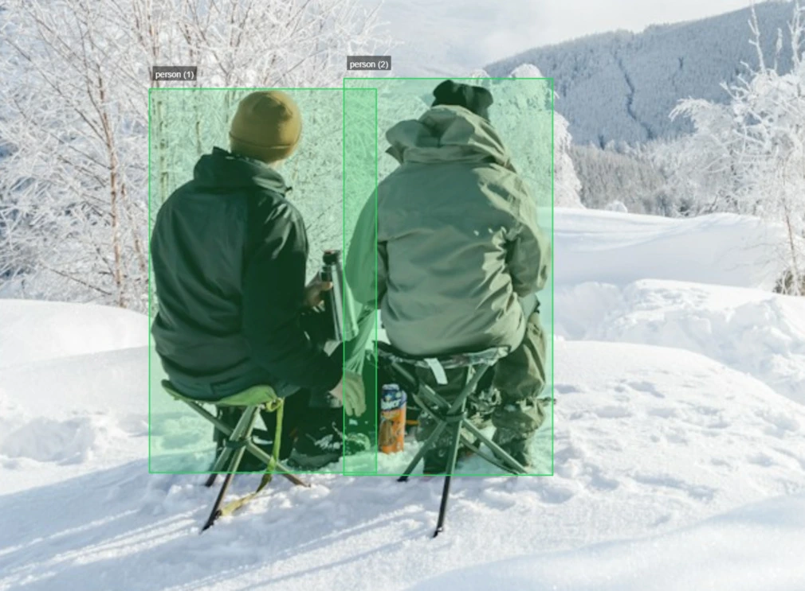

# PreAnnotate

<p align="center">
  
</p>

<h3 align="center">A secure, privacy-focused image annotation tool that runs entirely in your browser</h3>

<p align="center">
  
</p>

## Features

- **100% Private**: All operations run locally in your browser - no data ever leaves your device
- **No Sign-up Required**: Just open the app and start annotating
- **Intuitive Interface**: Easy-to-use drawing tools and keyboard shortcuts
- **YOLO Format Support**: Export annotations in YOLO format for machine learning projects
- **Custom Classes**: Create and manage your own object classes with auto-assigned colors
- **Import/Export**: Save your work and continue later with ZIP export/import functionality

## Getting Started

### Run Locally

PreAnnotate is a static web application, so you can run it using any local server.

#### Option 1: Using Python (SimpleHTTPServer)

```bash
# Navigate to the project directory
cd preannotate

# Python 3
python -m http.server 8000

# Or Python 2
python -m SimpleHTTPServer 8000
```

Then open your browser and visit: `http://localhost:8000`

#### Option 2: Using Node.js

```bash
# Install serve globally if you don't have it
npm install -g serve

# Navigate to the project directory
cd preannotate

# Start the server
serve -s .
```

#### Option 3: Using browser directly

Simply open the `index.html` file in your web browser.

## How to Use

1. **Upload Images**: Drag and drop your images or click the upload button
2. **Create Classes**: Enter class names in the left sidebar
3. **Draw Annotations**: Select a class and draw bounding boxes around objects
4. **Export Results**: Export your annotations in YOLO format for machine learning

### Keyboard Shortcuts

- **Ctrl + A**: Switch to Draw mode
- **Ctrl + M**: Switch to Move mode
- **Del**: Delete selected annotation
- **←/→**: Navigate between images
- **Tab**: Cycle between annotations

## Privacy

PreAnnotate is designed with privacy in mind. All image processing and annotation are performed locally in your browser. Your images and annotations never leave your device.

## Contributing

Contributions are welcome! Feel free to open issues or submit pull requests to help improve PreAnnotate.

## License

This project is open source and available under the [MIT License](LICENSE).

---

<p align="center">
  For the computer vision and machine learning community
</p>
